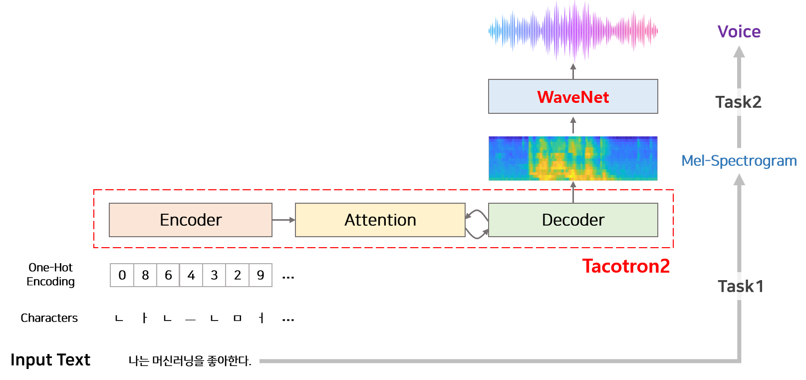
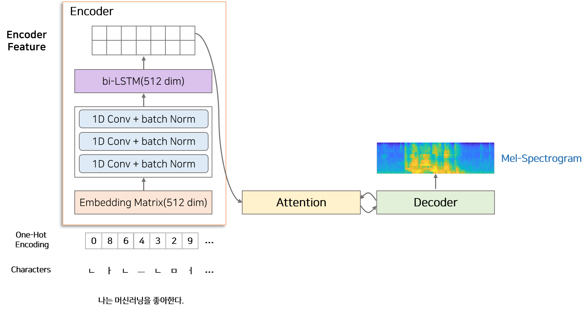
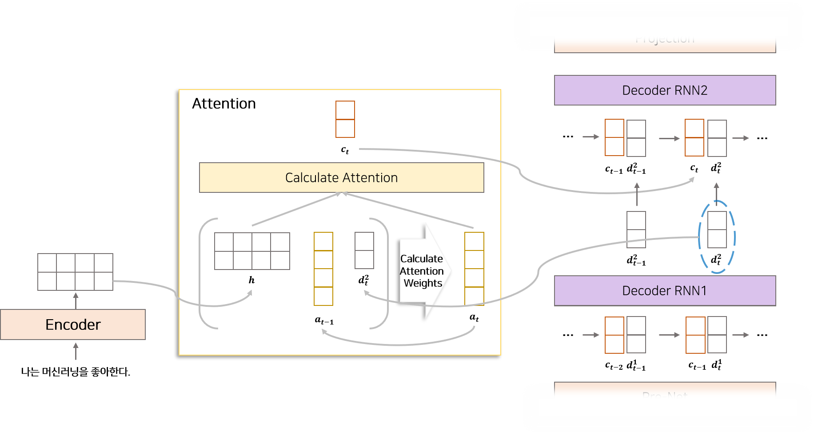
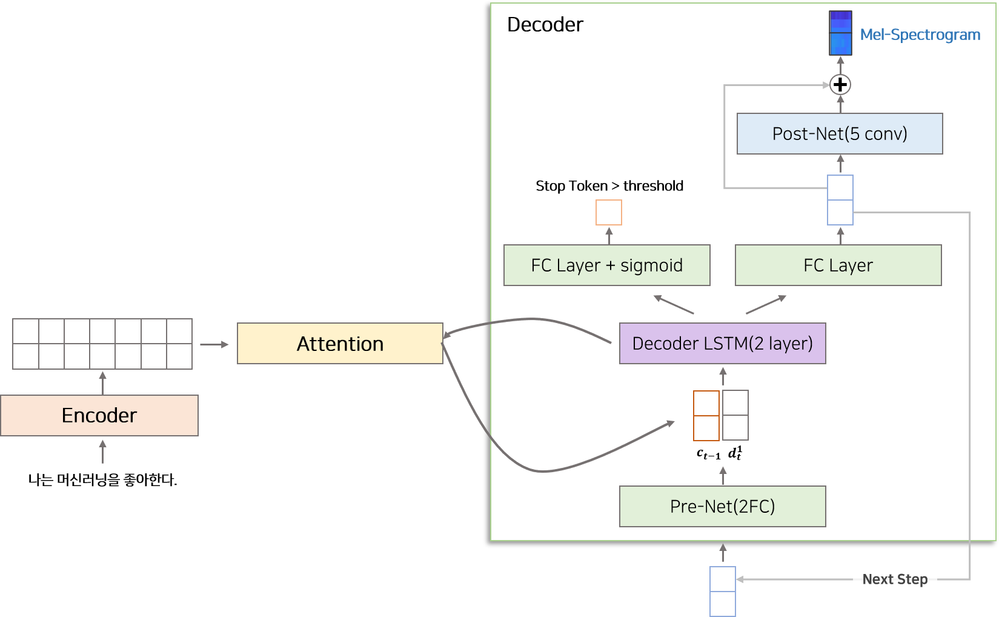
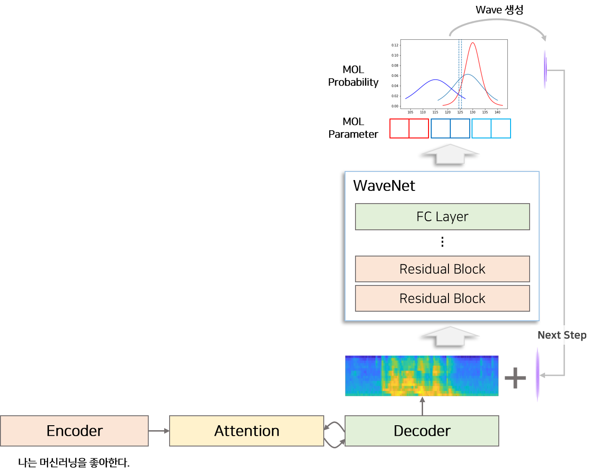

# Tacotron2

### 📌 참고 자료 
> - NATURAL TTS SYNTHESIS BY CONDITIONING WAVENET ON MEL SPECTROGRAM
    PREDICTIONS : https://arxiv.org/pdf/1712.05884v2
> - [논문리뷰]Tacotron2 : https://joungheekim.github.io/2020/10/08/paper-review/

## 1. 알아야할 용어 및 개념 그리고 기초 음성 도메인 

> - ### Tacotron2 모델 아키텍처
>   - 
> 
> - ### Attention 이란?
>   - 모델이 입력의 특정 부분에 집중하거나 가중치를 두고, 중요한 정보를 선택적으로 처리하는 메커니즘을 의미함
>   - 모델이 "어떤 부분을 더 중요하게 생각해야 하는지"를 선택하는 방식
>
> 
> - ### Seq-to-Seq 이란? 
>   - Seq-to-Seq TTS (Sequence-to-Sequence Text-to-Speech) 모델은 텍스트를 음성으로 변환하는 시스템에서 사용되는 딥러닝 모델
>   - 입력 텍스트(characters)를 출력 음성(오디오 시퀀스)로 변환하는 방식
>   - 인코더(Encoder)와 디코더(Decoder)로 구성
> 
> 
> - ### Encoder 란?
>   - 텍스트의 각 단어 또는 음절을 벡터(수치화된 표현)로 변환하여 입력 시퀀스를 처리
>   - 텍스트는 임베딩(embedding)이라는 방식으로 고차원 벡터로 변환
>   - 입력 텍스트를 처리하고, 그 의미를 벡터 형태로 압축하여 컨텍스트 벡터를 생성
> 
> 
> - ### Decoder 란?
>   - 디코더는 인코더에서 전달된 컨텍스트 벡터를 바탕으로 출력 시퀀스(여기서는 음성)를 생성
>   - 음성의 각 프레임을 생성하기 위해 이전 상태와 생성된 음성 특성(예: Mel-spectrogram) 등을 참조
> 
> 
> - ### End-to-End 방식
>   - 하나의 모델이 모든 단계를 처리하는 방식 
>   - 텍스트 입력을 받은 후, 그 자체로 음성을 생성
>   - 텍스트 전처리, 특징 추출, 음성 합성 등의 복잡한 단계를 모두 하나의 딥러닝 모델이 자동으로 처리함 
>
> - ### One-Hot Encoding 이란?
>   - 
> 
> 
> - ### Feature Alignment 이란?
>   - 
> 
> 
> - ### Alignment 이란?
> 
> 
> - ### mel-spectrogram 이란?
>   -
> 
> 
> - ### LSTM이란? 
>   - 
> 
> - ### 음성 관련 기초 도메인 정리 
>   -

### 2. 논문 리뷰 정리

#### 2-1. Summary

> - (1) Attention 기반 Seq-to-Seq TTS 모델 구조를 제시
> - (2) <문장, 음성> 으로 구성된 데이터만으로 별도 작업없이 학습이 가능한 End-to-End 모델
> - (3) 합성 품질이 우수함

#### 2-2. 모델 전체 구조 

> - 위 그림에서 확인할 수 있듯이 크게 2가지 부분으로 구분됨
>   - (1) Task1 : 텍스트로부터 Mel-spectrogram 을 생성
>   - (2) Task2 : Mel-spectrogram 으로부터 음성을 합성함
> - 두 단계로 분리한 이유는 해당 모델은 'Input-Output'이 '텍스트-음성'이지만, 텍스트로부터 음성을 바로 생성하기 어려움
> - 결국엔 아래와 같이 구분할 수 있음
>   - 데이터 전처리 : 텍스트 -> character
>   - Tacotron2 : character -> mel-spectrogram
>   - WaveNet : mel-spectrogram -> waveform(음성)

#### 2-3. Tacotron2(Seq2Seq)

> - 위에서 알 수 있듯이, Tacotron2의 input-output 형태는 character - mel-spectrogram
> - 해당 모델은 end-to-end 모델이며  텍스트를 음성으로 변환하는 시스템에서 사용되는 딥러닝 모델(Seq-to-Seq)을 기반으로함
> - 해당 모델은 크게 3가지 부분으로 분류할 수 있음
>   - (1) Encoder : 입력 값인 character 를 일련 길이의 hidden 벡터로 변환
>   - (2) Attention : Encoder 에서 생성된 일정 길이의 hidden 벡터로부터 시간 순서에 맞게 정보를 추출하여 Decoder에 전달. 쉽게 말해서, Encoder 에서 변환한 벡터 중에 중요 특성을 추출하여 Decoder 에게 전달함 
>   - (3) Decoder : Attention 에서 얻은 정보를 이용하여 mel-spectrogram 을 생성
>
> 
> - #### Encoder : 입력 값인 character 를 일련 길이의 hidden 벡터로 변환
>   - 
>   - 그림에서 보이는 것 처럼, Encoder는 크게 3가지로 구성됨 
>     - (1) Character Embedding : Character 단위의 One-Hot Vector를 의미 있는 밀집 벡터로 변환하여 입력의 차원을 축소
>     - (2) 3 Convolution Layer : 국소적인(전체가 아닌 특정한 작은 범위나 부분) 텍스트 패턴(문법 및 음운 규칙)을 학습하여 특징을 추출
>     - (3) Bidirectional LSTM : 양방향으로 문맥 정보를 학습하여 시퀀스 간의 전후 관계를 이해함
>
> 
>   - character 단위의 one-hot vector 를 encoded feature로 변환함 
>   - 그 이유는 딥러닝 모델은 문자와 같은 비정형 데이터를 직접 다룰 수 없기에 이를 수치 데이터로 변환해야함
>   - 즉, encoded feature가 딥러닝 모델에서 사용하는 수치형 데이터
>   - 여기서 one-hot vector로 변환된 정수열이 들어오면 Enbedding matrix를 통해 512차원의 embedding vector로 변환됨
>   - 이런식으로 차원을 확대한 이유는 모델이 더 많은 정보를 학습하기 위함. 즉, 해당 단계에서  Encoder가 텍스트 데이터를 더 세밀하고 효과적으로 이해할 수 있음 
>   - embedding vector는 3개의 conv-layer(1d convolution layer + batch norm)를 지나 bi-LSTM layer로 들어가서 encoded feature로 변환됨 
>
> 
> - ### Attention : Encoder 에서 생성된 일정 길이의 hidden 벡터로부터 시간 순서에 맞게 정보를 추출하여 Decoder에 전달. 쉽게 말해서, Encoder 에서 변환한 벡터 중에 중요 특성을 추출하여 Decoder 에게 전달함 
>   - 
>   - Attention은  매 시점 Deocder에서 사용할 정보를 Encoder에서 추출하여 가져오는 역할을 함
>   - 여기서 Attention Mechanism은  Encoder의 LSTM에서 생성된 feature와 Decoder의 LSTM에서 전 시점에서 생성된 feature를 이용하여 Encoder로 부터 어떤 정보를 가져올지 alignment하는 과정을 의미함 
>   - 즉, 해당 의미는  Attention이 Encoder로 부터 받은 벡터 값 중에서 중요한 벡터 값을 추출하는 것임 
>   
> 
> - ### Decoder : Attention 에서 얻은 정보를 이용하여 mel-spectrogram 을 생성
>   - 
>   - Decoder는 Attention을 통해 얻은 alignment feature와 이전 시점에서 생성된 mel-spectrogram 정보를 이용하여 다음 시점 mel-spectrogram을 생성하는 역할을 함
>   - 그림을 보면 알 수 있듯이 Decoder는 크게 4가지 부분으로 구성됨
>     - (1) Pre-Net : Decoder 입력 벡터(이전 출력 또는 초기 값)를 두 개의 Fully Connected Layer로 처리하여 차원을 조정하고 학습 가능한 표현으로 변환
>     - (2) Decoder LSTM : 현재 시점의 Pre-Net 출력과 Attention Context를 기반으로 다음 상태를 예측하는 Recurrent Layer로, 시퀀스 데이터를 처리
>     - (3) Projection Layer : Decoder LSTM의 출력 벡터를 음성 스펙트로그램의 프레임(중간 출력)으로 변환하기 위한 선형 변환 레이어
>     - (4) Post-Net : Projection Layer의 스펙트로그램 출력을 5개의 1D-CNN Layer로 후처리하여, 스펙트로그램의 품질을 개선하고 잔여 오류를 줄임 
>
>
> - Pre-Net은 bottle-neck 구간으로써 중요 정보를 거르는 역할을 함
> - Decoder LSTM은 Attention Layer의 정보와 Pre-Net으로부터 생성된 정보를 이용하여 특정 시점에 해당하는 정보를 생성함 

#### 2-4. WaveNet Vocoder

